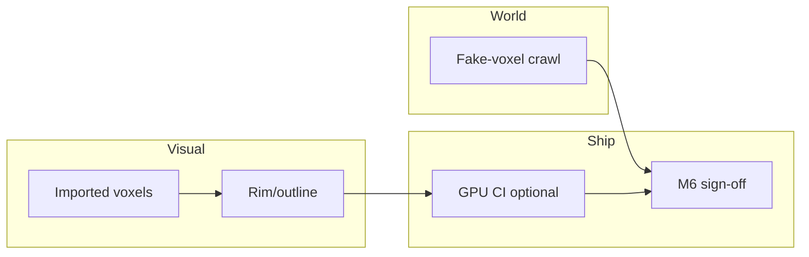

# Design — fake-voxel crawl, imported voxels, rim/outline, GPU CI, M6 sign-off

**Status:** design only (no implementation mandate). This document **coordinates** five workstreams that were previously scattered across [`CRAWL_PROTOTYPE_FUTURE.md`](CRAWL_PROTOTYPE_FUTURE.md), [`COMBAT_VOXEL_STAGE_FUTURE.md`](COMBAT_VOXEL_STAGE_FUTURE.md), [`docs/CI_GODOT_TESTS.md`](../../docs/CI_GODOT_TESTS.md), and [`M6_CUTOVER_CHECKLIST.md`](../M6_CUTOVER_CHECKLIST.md).

**Principles:** (1) **Combat logic** stays headless-testable without GPU. (2) **Crawl** is a **2D fake-voxel** layer unless a later milestone explicitly moves it to 3D. (3) **M6** remains **human-gated**; this design defines *what evidence* satisfies sign-off, not automatic promotion.

---

## 1. Fake-voxel crawl overworld

### 1.1 Intent

Deliver a **structured overworld** (steps, tiles, or discrete nodes) that **feels** blocky/voxel-adjacent using **2D** techniques—aligned with [`CRAWL_PROTOTYPE_FUTURE.md`](CRAWL_PROTOTYPE_FUTURE.md). Combat continues to resolve in [`combat.tscn`](../scenes/combat.tscn); crawl never runs `CombatManager` tick logic.

### 1.2 Visual stack (recommended)

| Layer | Technique | Notes |
|--------|-----------|--------|
| **Ground** | `TileMapLayer` (or dual layers: base + “top faces”) | Isometric **or** oblique orthogonal with **tinted top/side** tiles (three tiles per block type: top, left face, right face) |
| **Props** | `Sprite2D` / small `AtlasTexture` chunks | Reuse palette from [`ART_DIRECTION_GODOT.md`](ART_DIRECTION_GODOT.md) |
| **Depth read** | Y-sort or explicit z-index per row | Keeps party marker unambiguous |
| **Mood** | Optional `GPUParticles2D`, subtle shader on **crawl-only** `CanvasItem` | Must not block headless (scene can skip particles when `OS.has_feature("headless")`) |

### 1.3 Scene & code architecture

- **Entry:** `scenes/crawl_overworld.tscn` (name flexible) root `Node2D` + `CrawlController` script.
- **State:** Read/write **`GameState`** + **`SaveService`** only through existing patterns (same as hub): e.g. `crawl_region_id`, `crawl_tile_x`, `crawl_tile_y` or `crawl_node_id`—**add fields** to save schema with `SaveService.SAVE_VERSION` bump when implemented.
- **Encounters:** Data-driven table (`data/crawl/encounters.json` or rows in `locations_registry`): tile/node id → `pending_combat_encounter_path` (already used by `CombatManager`) + optional narrative beat id.
- **Return path:** After `combat_ended`, `combat_root` returns to hub **or** to crawl based on **`GameState.last_scene_was_crawl`** (bool) set before `change_scene_to_file`.

### 1.4 Phased delivery

| Phase | Outcome | Proof |
|-------|---------|--------|
| **C0** | Empty crawl scene loads headless; mounts 1 frame; exits | Extend `run_headless_tests.gd` |
| **C1** | One **corridor** (10–20 tiles), player token moves on grid, **blocked** edges | Manual + headless position assert |
| **C2** | **One** encounter trigger → combat → **return** to same crawl coordinates + flag | Headless: stub input or direct `CrawlController` API for CI |
| **C3** | Branch path + fog-of-war **optional** | Manual QA row in [`STEAM_BUILD.md`](../STEAM_BUILD.md) |

### 1.5 Risks

- **Scope creep:** treat crawl as **navigation + triggers**, not mini-combat.  
- **Save migration:** every new crawl field needs defaults in `SaveService` load path.  
- **Hub duplication:** decide whether crawl **replaces** part of hub travel for Act-1 or **coexists** (document in `PARITY_GAPS.md`).

---

## 2. Imported voxel assets (authoring → Godot)

### 2.1 Intent

Replace or augment **procedural** [`combat_voxel_arena.gd`](../scripts/combat_voxel_arena.gd) and crawl props with **authored** voxel meshes while keeping **combat rules** in `CombatManager`.

### 2.2 Authoring pipeline

| Step | Tool | Output |
|------|------|--------|
| Model | **MagicaVoxel** (or compatible) | `.vox` |
| Export | Official exporter, **MagicaVoxel-Exporter**, or **Goxel** → glTF | `.gltf` / `.glb` |
| Import | Godot 4 **Importer** | `PackedScene` or `Mesh` + materials |

**Convention:** `assets/voxel/<context>/<name>/` with `README.md` citing license; row in [`docs/ASSET_LICENSES.md`](../../docs/ASSET_LICENSES.md).

### 2.3 In-engine use

| Context | Approach |
|---------|----------|
| **Combat arena** | Replace `MultiMesh` floor with **instanced** imported chunks **or** single merged mesh per biome; keep actors as separate `Node3D` children |
| **Crawl** | Prefer **2D renders** (orthogonal PNG from voxel tool) as tiles—**optional** 3D crawl only if C0–C3 complete in 2D |
| **Materials** | One **BiomePalette** resource mapping albedo → `KyndeBladeArtPalette` hues for coherence |

### 2.4 Performance & CI

- **Draw calls:** merge static arena into fewer meshes where possible; use **MultiMesh** for repeated columns.  
- **Headless:** imported scenes must **load** without GPU errors (already true for mesh-only GLTF on most CI images).

### 2.5 Acceptance

- [ ] At least one **CC0/CC-BY** set in-repo with license file.  
- [ ] Combat scene boots with **either** procedural **or** imported arena selected by export flag on `VoxelArena` or sibling loader node.  
- [ ] `PARITY_GAPS.md` row updated: “imported voxel art — partial / full”.

---

## 3. Rim / outline shaders (3D combat read)

### 3.1 Intent

Improve **silhouette** and **feint vs swing** *read* on the 3D stage **without** moving HUD into a `SubViewport` texture (see [`COMBAT_VOXEL_STAGE_FUTURE.md`](COMBAT_VOXEL_STAGE_FUTURE.md)).

### 3.2 Options (pick 1–2 for slice)

| Technique | Pros | Cons |
|-----------|------|------|
| **Rim lighting** (`StandardMaterial3D` rim + tuned albedo) | Cheap, no extra pass | Weaker on flat albedo |
| **Inverted hull / mesh outline** | Strong comic read | Extra geometry or duplicate mesh |
| **Per-object fresnel** in lightweight custom shader | Controllable | Artist tuning |
| **Post Sobel on depth** (if pipeline allows) | Unified outline | Heavier; Forward+ / depth texture availability |

**Recommendation for slice:** start with **rim + slight emission pulse** on enemy mesh during `REAL_TIME_WINDOW` when `_enemy_will_hit` (wired from `combat_presentation_3d.gd`), **before** full-screen post.

### 3.3 Integration points

- **Materials:** combat enemy/player materials as `.tres` overrides on `MeshInstance3D`.  
- **State:** subscribe to `CombatManager.defensive_window_started` / `presentation_tick` for **non-destructive** visual only.  
- **Accessibility:** outline **must not** be the only feint indicator (audio + eye UI remain mandatory per wireframe checklist).

### 3.4 Acceptance

- [ ] STEAM_BUILD manual row: “Feint vs true edge readable at 960×540 with outline **off** and **on**.”  
- [ ] Optional GPU CI captures one frame with outline enabled (see §4).

---

## 4. Optional GPU CI

### 4.1 Intent

Add a **non-blocking** or **nightly** job that proves **3D scene instantiation + one rendered frame** without weakening the mandatory **headless logic** suite.

### 4.2 Job design (GitHub Actions–shaped)

| Job id | Runner | Steps | Pass criteria |
|--------|--------|--------|----------------|
| `godot-headless` (existing) | `ubuntu-latest` | `godot --path KyndeBlade_Godot --headless res://tests/headless_main.tscn` | `HEADLESS_TESTS: PASS` |
| `godot-gpu-smoke` (optional) | `ubuntu-latest` + **software GL** **or** self-hosted with GPU | Install Godot; `xvfb-run -a godot --path ... --headless --quit-after 1` **or** dedicated export template with `--display-driver windows` on Windows runner | Process exit 0; optional **artifact** `frame.png` |

**Godot 4 note:** true pixel readback may require `--write-movie` / project-specific capture script; acceptable MVP: **log line** “CombatArena3D instantiated” from a `--script` runner that loads `combat.tscn` and quits—**upgrade** to PNG diff later.

### 4.3 Policy

- **Default branch protection:** require `godot-headless` only.  
- **GPU job:** `continue-on-error: true` until stable, or run **nightly** only.  
- Document in [`docs/CI_GODOT_TESTS.md`](../../docs/CI_GODOT_TESTS.md) under **Optional GPU**.

### 4.4 Acceptance

- [ ] CI doc lists variables: `GODOT_VERSION`, path to binary, timeout.  
- [ ] Flake budget: if GPU job fails, open issue template “GPU smoke failed” with artifact link.

---

## 5. Formal M6 sign-off

### 5.1 Intent

M6 is **governance**, not a feature: it declares **Godot the live behaviour oracle** for the agreed slice (with documented gaps), while **keeping** Unity in-tree as reference. Align with [`M6_CUTOVER_CHECKLIST.md`](../M6_CUTOVER_CHECKLIST.md) and [`.tdad/prompts/godot-archive-unity-snapshot.md`](../../.tdad/prompts/godot-archive-unity-snapshot.md).

### 5.2 RACI (suggested)

| Role | Responsibility |
|------|----------------|
| **Product / creative lead** | Accepts player-facing slice + voice (`CULT_SHIP_BAR` bar optional but documented). |
| **Engineering lead** | Signs headless CI + save migration safety. |
| **TDAD owner** | Updates root workflow: `godot-parity-slice` = canonical for Tier A checks; Unity `demo-vertical-slice` = **historical spec**. |

### 5.3 Evidence bundle (attach to sign-off PR)

1. **Test log:** latest `HEADLESS_TESTS: PASS` from `main`.  
2. **Manual attestation:** STEAM_BUILD checklist completed (name + date in PR body or `docs/M6_SIGNOFF_<DATE>.md`).  
3. **Parity:** `PARITY_GAPS.md` diff reviewed—no silent behaviour drift.  
4. **BDD:** `.tdad/bdd/godot-parity-slice.feature` scenarios tagged `@manual` explicitly listed as manual-only.  
5. **Unity snapshot:** frozen SHA + Editor version in [`ProjectArchive/UnityKyndeBlade/README.md`](../../ProjectArchive/UnityKyndeBlade/README.md) (table already exists).  
6. **Rollback tag:** git tag `pre-m6-oracle-handoff` (or similar) on parent commit.

### 5.4 TDAD graph change (conceptual)

- **`godot-m6-cutover-archive`:** mark **done** with link to sign-off PR.  
- **`demo-vertical-slice`:** description footnote “oracle superseded by Godot parity slice as of M6-YYYY-MM-DD”.  
- **No automatic deletion** of `ProjectArchive/UnityKyndeBlade/KyndeBlade_Unity`.

### 5.5 Acceptance

- [ ] Single PR titled `chore: M6 Godot oracle handoff` containing metadata + doc updates only (no gameplay surprise in same PR, unless pre-approved).  
- [ ] Announcement: one paragraph in root `README.md` “Behaviour oracle” subsection.

---

## 6. Dependency order (recommended)

- **Crawl** and **combat voxel import** can proceed in **parallel** after C0.  
- **M6** should not block on GPU CI or rim shaders; those are **quality gates**, not oracle gates.

---

## 7. Related files

| Doc / code | Role |
|------------|------|
| [`GODOT_PLANS_INDEX.md`](GODOT_PLANS_INDEX.md) | Plan status rollup |
| [`UNITY_REFERENCE_ARCHIVE.md`](../../ProjectArchive/UnityKyndeBlade/UNITY_REFERENCE_ARCHIVE.md) | Unity vs Godot roles |
| [`WIREFRAME_COMBAT_CHECKLIST.md`](WIREFRAME_COMBAT_CHECKLIST.md) | Manual combat read |
| [`TDAD_COMBAT_PRESENTATION_PLAN.md`](TDAD_COMBAT_PRESENTATION_PLAN.md) | CP segments |

**Version:** 1.0 — design consolidation.

---

## 8. Implementation status (in-repo)

| Area | Shipped in repo | Next |
|------|-----------------|------|
| **Crawl C0** | [`scenes/crawl_overworld.tscn`](../scenes/crawl_overworld.tscn), [`crawl_overworld.gd`](../scripts/crawl_overworld.gd), headless `crawl_overworld_scene_smoke` | C1 TileMap corridor + movement |
| **Imported voxels** | [`assets/voxel/README.md`](../assets/voxel/README.md) scaffold | First CC0 `.glb` + loader toggle in combat |
| **Rim / outline** | `PlayerMat` / `EnemyMat` in [`combat.tscn`](../scenes/combat.tscn): **per-pixel shading + rim** | Pulse rim on defensive window in `combat_presentation_3d.gd` (optional) |
| **GPU CI** | [`.github/workflows/godot-ci.yml`](../../.github/workflows/godot-ci.yml): required headless + **optional** `godot-display-smoke` (`continue-on-error`, `xvfb-run`) | Frame capture / artifact diff |
| **M6** | [`M6_SIGNOFF_TEMPLATE.md`](M6_SIGNOFF_TEMPLATE.md) + checklist links | Human sign-off only |
