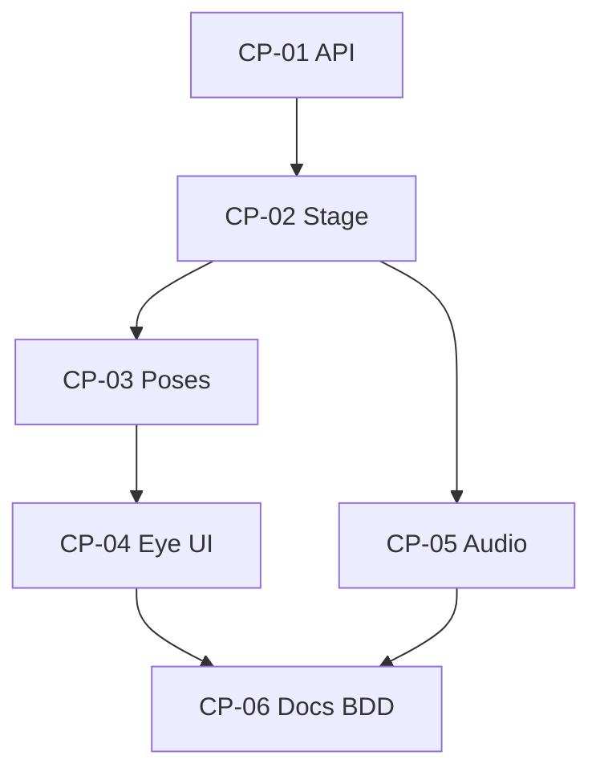

# TDAD — Combat presentation (Godot ↔ Unity model)

**Purpose:** Segmented implementation plan to move Godot combat from **HUD-only** to **dynamic presentation** aligned with Unity’s combat pipeline (side-view stage, actor read, defensive window feedback), without changing combat **rules** unless a later wave explicitly ports them.

**Oracle (until M6 archive):** Unity [`KyndeBladeGameManager`](../../ProjectArchive/UnityKyndeBlade/KyndeBlade_Unity/Assets/KyndeBlade/Code/Combat/KyndeBladeGameManager.cs), [`CombatUI`](../../ProjectArchive/UnityKyndeBlade/KyndeBlade_Unity/Assets/KyndeBlade/Code/Combat/UI/CombatUI.cs), [`ParryDodgeZoneIndicator`](../../ProjectArchive/UnityKyndeBlade/KyndeBlade_Unity/Assets/KyndeBlade/Code/Combat/UI/ParryDodgeZoneIndicator.cs), [`TurnManager`](../../ProjectArchive/UnityKyndeBlade/KyndeBlade_Unity/Assets/KyndeBlade/Code/Combat/TurnManager.cs) + [`ART_DIRECTION.md`](../../ProjectArchive/UnityKyndeBlade/KyndeBlade_Unity/Assets/KyndeBlade/Docs/ART_DIRECTION.md) Lane B.

**TDAD tracks touched:** `godot-parity-slice` (extend), `scenes`, `combat-defense` (presentation only), `ui-shell`, `audio` (optional SFX), `characters` (visual stub only). **Wave placement:** extends **W4 / W5** presentation layer; does not close W6 systems.

---

## 1. Scope boundary

| In scope | Out of scope (later waves) |
|----------|----------------------------|
| Read-only hooks from `CombatManager` for UI/stage (`state`, `window_remaining`, `window_duration`, `is_enemy_swing_real`) | Full `MedievalCharacter` / Kynde / break stacks |
| 2D stage layout, placeholder actors, Lane B backdrop + optional hazard strip | URP/Built-in shader parity, 3D illumination sphere |
| Parry/dodge **eye** (or equivalent) phased like Unity | Full `ParryDodgeZoneSoundBank` asset parity |
| Optional hit flash, micro-shake, bus-routed SFX stubs | Narrative camera cuts, multi-enemy layout from `EncounterConfig` |

---

## 2. TDAD traceability matrix

| Segment ID | User-visible outcome | Primary TDAD workflows | Parity / proof |
|------------|----------------------|------------------------|----------------|
| **CP-01** | Presentation can read window phase | `combat-defense`, `godot-parity-slice` | Headless unchanged; unit-style assert on `window_duration` when window opens |
| **CP-02** | Combat has a side-view **stage** (two actors + backdrop) | `scenes`, `godot-parity-slice` | Manual: actors visible; screenshot baseline optional |
| **CP-03** | State-driven **poses** (idle / strike / defend / enemy wind-up) | `combat-actions`, `characters` (visual only) | Manual + optional headless signal spy |
| **CP-04** | **Parry/dodge indicator** + “React! t” label | `combat-defense`, `ui-shell` | Manual: phases feel like Unity; BDD scenario (below) |
| **CP-05** | **Feedback** (flash, shake, SFX hooks) | `audio`, `perf` (budget) | Manual; buses exist (`AudioBusSetup`) |
| **CP-06** | Docs, BDD, `PARITY_GAPS` | `godot-parity-slice` | CI: `run_headless_tests.gd` + updated `.feature` |

---

## 3. Segmented implementation (execution order)

Dependencies: **CP-01 → CP-02 → CP-03 → CP-04**; **CP-05** parallel after CP-02; **CP-06** last.

### CP-01 — CombatManager presentation API

- **Goal:** Unity’s UI reads `RealTimeWindowDuration` / `RealTimeWindowRemaining`; Godot exposes equivalents without breaking instant-resolution tests.
- **Work:**
  - Add `window_duration: float` set when defensive window starts; document alongside `window_remaining`.
  - Optional: `signal presentation_tick(state, window_t)` where `window_t = 1.0 - remaining/max(duration,ε)` clamped — only if it reduces coupling vs polling in `_process`.
- **Files:** [`scripts/combat_manager.gd`](../scripts/combat_manager.gd).
- **Tests:** [`tests/combat_scenarios.gd`](../tests/combat_scenarios.gd) must still pass; add one scenario or small test func asserting `window_duration > 0` after `player_dodge()` if feasible without wall clock.
- **Exit criteria:** No regression in headless suite; public fields documented in `STEAM_BUILD.md` “Combat internals (presentation)”.

### CP-02 — Combat stage (Lane B)

- **Goal:** Match Unity **orthographic side-view** *read*: two opposing silhouettes, void backdrop (already partially present), optional **foreground hazard strip** ([`EnsureCombatForegroundHazardStrip`](../../ProjectArchive/UnityKyndeBlade/KyndeBlade_Unity/Assets/KyndeBlade/Code/Combat/KyndeBladeGameManager.cs)).
- **Work:**
  - `Node2D` `CombatStage` under [`scenes/combat.tscn`](../scenes/combat.tscn): `PlayerActor`, `EnemyActor` roots (Polygon2D / `Sprite2D` + procedural texture or palette colors from [`KyndeBladeArtPalette`](../scripts/kyndeblade_art_palette.gd)).
  - Camera: either fixed positions for 960×540 or embedded `SubViewport` (reuse pattern from [`hi_bit_bonus_level.tscn`](../scenes/hi_bit_bonus_level.tscn) if integer snap matters).
  - Hazard strip: bottom `ColorRect`/`Polygon2D`, toggled via export or `EncounterDef` flag later; default off for slice.
- **Files:** `combat.tscn`, new `scripts/combat_stage.gd` (optional).
- **Tests:** Manual checklist row; optional headless scene tree probe (fragile — prefer manual for CP-02).
- **Exit criteria:** Play Mode: entering combat shows stage + void; UI still readable (contrast per Lane B doc).

### CP-03 — Presentation controller & poses

- **Goal:** **Dynamic** feel: actors react to `CombatManager` state, not static meshes.
- **Work:**
  - New `CombatPresentation` (or extend [`combat_root.gd`](../scripts/combat_root.gd)): subscribe `turn_changed`, `stats_changed`; on `REAL_TIME_WINDOW` set enemy “telegraph” tint (hit vs feint via `is_enemy_swing_real()`); on strike short player lunge tween; on enemy turn small recoil on damage application (signal from manager if missing — add **presentation-only** signal `enemy_received_damage(amount)` if needed).
  - Keep all motion **cosmetic**; do not alter HP/stamina in presentation layer.
- **Files:** `scripts/combat_presentation.gd`, `combat_manager.gd` (signals only if necessary), `combat.tscn`.
- **Tests:** Headless: if new signals fire, assert order in scenario; else manual only.
- **Exit criteria:** Player can see difference between **feint** and **real swing** windows (color or pose).

### CP-04 — Parry/dodge zone indicator (Unity eye equivalent)

- **Goal:** Parity with [`ParryDodgeZoneIndicator`](../../ProjectArchive/UnityKyndeBlade/KyndeBlade_Unity/Assets/KyndeBlade/Code/Combat/UI/ParryDodgeZoneIndicator.cs): show only in real-time window; phased **open → steady → imminent** (`OpenPhaseEnd` 0.15, `ImminentPhaseStart` 0.75); label **“React! X.Xs”** like [`CombatUI` Update](../../ProjectArchive/UnityKyndeBlade/KyndeBlade_Unity/Assets/KyndeBlade/Code/Combat/UI/CombatUI.cs).
- **Work:**
  - New scene `scenes/parry_dodge_eye.tscn` + `scripts/parry_dodge_eye.gd` (`Control`: sclera, pupil scale, eyelid offsets — can simplify to one `TextureProgress` + mask if faster).
  - Parent under combat `UI` `CanvasLayer`; `visible = false` when not `REAL_TIME_WINDOW`.
- **Files:** new scene/script; [`combat_root.gd`](../scripts/combat_root.gd) wiring.
- **Tests:** Extend [`.tdad/bdd/godot-parity-slice.feature`](../../.tdad/bdd/godot-parity-slice.feature) with scenario *“Parry dodge indicator visible during defensive window”*; manual verification required for animation curve.
- **Exit criteria:** BDD scenario green (visibility assertion via test hook or `CombatManager.use_instant_resolution_for_tests` + synthetic frame step — if too brittle, mark scenario `@manual` and keep headless strict).

### CP-05 — Audio / hit feedback (optional but recommended)

- **Goal:** Unity [`CombatFeedback`](../../ProjectArchive/UnityKyndeBlade/KyndeBlade_Unity/Assets/KyndeBlade/Code/Combat/CombatFeedback.cs) parity **light**: play one-shots on dodge success/fail, parry, hit; respect Master volume.
- **Work:**
  - `AudioStreamPlayer` nodes under combat; call from presentation or small `CombatFeedbackGodot` script; CC0 placeholders in [`assets/third_party/`](../assets/third_party/) + row in [`docs/ASSET_LICENSES.md`](../../docs/ASSET_LICENSES.md).
- **Exit criteria:** No console errors; volume slider affects combat SFX.

### CP-06 — Documentation & parity ledger

- **Work:**
  - [`PARITY_GAPS.md`](../PARITY_GAPS.md): row “Combat presentation — Unity full vs Godot staged (placeholders)”.
  - [`STEAM_BUILD.md`](../STEAM_BUILD.md): manual QA steps for CP-02–CP-05.
  - This file: mark segments **DONE** with PR links when executed.
  - Optional: add nodes to [`.tdad/workflows/godot-parity-slice/godot-parity-slice.workflow.json`](../../.tdad/workflows/godot-parity-slice/godot-parity-slice.workflow.json) (`gparity-combat-stage`, `gparity-parry-dodge-eye`) for TDAD graph truth.

---

## 4. Test strategy (by layer)

| Layer | CP-01 | CP-02 | CP-03 | CP-04 | CP-05 | CP-06 |
|-------|-------|-------|-------|-------|-------|-------|
| Headless `run_headless_tests.gd` | **Required** | No break | Optional | Optional | Optional | **Required** |
| `combat_scenarios.gd` | **Required** | — | Optional | Optional | — | — |
| BDD `godot-parity-slice.feature` | — | Manual | Manual | Add scenario | — | **Required** pass |
| Manual QA ([`STEAM_BUILD.md`](../STEAM_BUILD.md)) | — | **Required** | **Required** | **Required** | **Required** | — |

---

## 5. Dependency diagram

---

## 6. Risks & mitigations

| Risk | Mitigation |
|------|------------|
| Headless flakiness from animation/frame timing | Keep logic tests on `CombatManager` only; UI tests use instant flag or `@manual` BDD. |
| SubViewport input / scaling | Prefer top-level `Node2D` stage + single window camera; match [`ART_DIRECTION`](../../ProjectArchive/UnityKyndeBlade/KyndeBlade_Unity/Assets/KyndeBlade/Docs/ART_DIRECTION.md) PPU note when swapping to sprites. |
| Scope creep (full TurnManager port) | Explicit “presentation only” in PR template; reject rule changes in CP segments. |

---

## 7. Definition of done (whole initiative)

- [ ] All CP segments marked complete with tests listed above satisfied.
- [ ] `HEADLESS_TESTS: PASS` from repo root Godot command (see [`CI_GODOT_TESTS.md`](../../docs/CI_GODOT_TESTS.md)).
- [ ] Manual slice: hub → combat → dodge/parry sees **eye** + stage motion + readable bars.
- [ ] `PARITY_GAPS.md` and BDD updated; no undocumented drift vs Unity oracle.

---

## 8. Related repo files

| File | Role |
|------|------|
| [`PORT_WAVE.md`](../PORT_WAVE.md) | Wave context (W4/W5 extension) |
| [`PARITY_GAPS.md`](../PARITY_GAPS.md) | Ledger updates |
| [`docs/ART_DIRECTION_GODOT.md`](ART_DIRECTION_GODOT.md) | Lane A/B + manuscript colors |
| [`.tdad/workflows/godot-parity-slice`](../../.tdad/workflows/godot-parity-slice/godot-parity-slice.workflow.json) | TDAD node IDs (extend) |

**Version:** 1.0 — planning document; execution creates PRs per CP segment.

### Implementation status (baseline delivered)

- **CP-01** — `window_duration`, `window_phase_t()`, `defensive_window_started(is_real_swing)`, `feint_pattern_offset` / `enemy_swing_is_hit_for_window_index(..., pattern_offset)` on [`CombatManager`](../scripts/combat_manager.gd); headless asserts in [`combat_scenarios.gd`](../tests/combat_scenarios.gd) (incl. misstep invert).
- **CP-02** — [`CombatStage`](../scenes/combat.tscn) + hazard strip (`show_foreground_hazard`, default off).
- **CP-03** — [`combat_presentation.gd`](../scripts/combat_presentation.gd) (idle, window telegraph, strike punch, player hit flash + `Camera2D` shake on heavy damage).
- **CP-04** — [`parry_dodge_eye.tscn`](../scenes/parry_dodge_eye.tscn) + [`combat_root.gd`](../scripts/combat_root.gd) `setup(combat)`.
- **CP-05** — Procedural window tones: [`combat_window_tone.gd`](../scripts/combat_window_tone.gd) + `WindowSfx` on [`combat.tscn`](../scenes/combat.tscn) (SFX bus); [`docs/ASSET_LICENSES.md`](../../docs/ASSET_LICENSES.md) row.
- **CP-06** — [`PARITY_GAPS.md`](../PARITY_GAPS.md), [`STEAM_BUILD.md`](../STEAM_BUILD.md), [`.tdad/bdd/godot-parity-slice.feature`](../../.tdad/bdd/godot-parity-slice.feature) updated.
