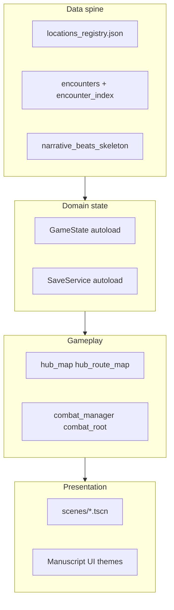

# Kynde Blade — game structure (Godot shipping)

Single entry point for **how the retail Godot project is organized**, how it relates to the Unity archive, and how to improve quality without a monolithic rewrite. Complements [KyndeBlade_Godot/docs/GAME_SKELETON.md](../KyndeBlade_Godot/docs/GAME_SKELETON.md) (content spine) and [docs/UNITY_GODOT_MODULE_MAP.md](UNITY_GODOT_MODULE_MAP.md) (Unity → Godot map).

---

## Phase 0 — Quality scope (rebuild plan)

**Pillars for this pass** (lock before broad refactors):

1. **Combat readability** — timed defense windows, telegraph, and HUD read match [KyndeBlade_Godot/docs/WIREFRAME_COMBAT_CHECKLIST.md](../KyndeBlade_Godot/docs/WIREFRAME_COMBAT_CHECKLIST.md) and [KyndeBlade_Godot/docs/COMBAT_REVIEW_WIREFRAME_E33.md](../KyndeBlade_Godot/docs/COMBAT_REVIEW_WIREFRAME_E33.md).
2. **Hub travel clarity** — route map fog, Fair Field / Dongeoun flow, and counsel → combat handoff in [KyndeBlade_Godot/scripts/hub/hub_map.gd](../KyndeBlade_Godot/scripts/hub/hub_map.gd).

**Manual slice playtest checklist** (human; run in editor or debug build):

- [ ] Main menu → New Game → hub loads; **Continue** disabled without save / enabled with save.
- [ ] Hub: route pins and **Fayr Feeld** path; counsel choices affect flavor / meta where documented.
- [ ] Fair Field combat: strike, dodge, parry, feint chip; victory / defeat return sensibly.
- [ ] Settings: volume and fullscreen persist across restart ([KyndeBlade_Godot/STEAM_BUILD.md](../KyndeBlade_Godot/STEAM_BUILD.md)).

**Gaps to file after playtest:** add rows to [KyndeBlade_Godot/PARITY_GAPS.md](../KyndeBlade_Godot/PARITY_GAPS.md) or the **Triage** section there; link checklist items to issues if tracked externally.

---

## Layer diagram (data → domain → gameplay → presentation)

**Rule of thumb:** add **data** (location, encounter, beat) first; then **GameState / save** fields if needed; then **gameplay** logic; keep **presentation** as signals and scene changes ([ManuscriptNav](../KyndeBlade_Godot/scripts/bootstrap/manuscript_nav.gd) for page-turn transitions).

---

## Authoritative docs (baseline)

| Doc | Role |
|-----|------|
| [KyndeBlade_Godot/docs/GAME_SKELETON.md](../KyndeBlade_Godot/docs/GAME_SKELETON.md) | Campaign spine: ids, registry, hub route, encounters, beats, `WorldNav`, weather. |
| [docs/UNITY_GODOT_MODULE_MAP.md](UNITY_GODOT_MODULE_MAP.md) | Unity assemblies → Godot folders. |
| [KyndeBlade_Godot/PARITY_GAPS.md](../KyndeBlade_Godot/PARITY_GAPS.md) | Intentional vs TODO vs Unity oracle. |
| [docs/EXTERNAL_STRUCTURE_NOTES.md](EXTERNAL_STRUCTURE_NOTES.md) | External community notes (e.g. GameDev.net via FlareSolverr); optional. |

**Unity architecture principles** (archive): [ProjectArchive/UnityKyndeBlade/KyndeBlade_Unity/Assets/KyndeBlade/ARCHITECTURE.md](../ProjectArchive/UnityKyndeBlade/KyndeBlade_Unity/Assets/KyndeBlade/ARCHITECTURE.md) — separation of concerns, modularity, KISS.

---

## Godot autoloads (`project.godot`)

| Autoload | Script | Role |
|----------|--------|------|
| `AudioBusSetup` | `scripts/bootstrap/audio_bus_setup.gd` | Bus layout (`Music`, `SFX`). |
| `InputMapSetup` | `scripts/bootstrap/input_map_setup.gd` | Default actions if map empty. |
| `SaveService` | `scripts/bootstrap/save_service.gd` | Save / settings / autosave paths. |
| `GameState` | `scripts/bootstrap/game_state.gd` | Run state, location, combat flags, Piers metadata. |
| `ManuscriptNav` | `scripts/bootstrap/manuscript_nav.gd` | Scene transitions with manuscript overlay. |
| `WorldNav` | `scripts/world/world_nav.gd` | World / location navigation helpers. |

### Other script folders (`KyndeBlade_Godot/scripts/`)

| Folder | Contents |
|--------|----------|
| `combat/` | `CombatManager`, presentation, voxel arena, parry/dodge eye, moveset modifiers, medieval catalog, ink, window SFX |
| `hub/` | Hub map, route map, crawl parallax helpers |
| `ui/` | Main menu, tower/story arrival, manuscript theme + palette, combat manuscript backdrop |
| `dev/` | Bonus / practice / Malvern yard slice scenes |
| `world/` | Registry, narrative beats, weather, `UnityExportData`, `WorldNav` |
| `art/` | Placeholder actors and backdrops |

---

## Target structural principles

| Principle | Application |
|-----------|-------------|
| Single source of truth | `data/world/locations_registry.json` + export pipeline; avoid duplicating graph edges in code without comment. |
| Slice-first | Polish menu → hub → Fair Field → combat → return before expanding the map. |
| Observable subsystems | Prefer signals (`CombatManager`, `HubRouteMap.travel_requested`) over deep coupling. |
| Regression safety | Extend [KyndeBlade_Godot/tests/combat_scenarios.gd](../KyndeBlade_Godot/tests/combat_scenarios.gd); run `godot4 --path KyndeBlade_Godot --headless res://tests/headless_main.tscn`. |
| Parity honesty | Every behavior change updates PARITY_GAPS or marks Godot as lead explicitly. |

---

## Phase 2 — Audit: large gameplay scripts (this pass)

**Metrics:** [`hub/hub_map.gd`](../KyndeBlade_Godot/scripts/hub/hub_map.gd) ~385 lines, [`combat/combat_manager.gd`](../KyndeBlade_Godot/scripts/combat/combat_manager.gd) ~425 lines (approximate; check `wc -l`).

### `hub_map.gd`

- **Cohesive units:** basemap + weather (`_apply_hub_basemap`, `_apply_hub_weather`), validation (`_validate_*`), counsel / flavor UI, route travel handler, combat handoff.
- **Coupling:** `HubRouteMap`, `AtmosphereProfile`, `WeatherParticles`, `UnityExportData`, `GameState`, `NarrativeBeats`.
- **Extraction this pass:** **none** — responsibilities are hub-specific; splitting would add indirection without a single duplicated second consumer. Revisit if a second scene needs identical basemap+weather setup or tests need isolated units.

### `combat_manager.gd`

- **Cohesive units:** state machine, signals for UI/presentation, encounter-driven tuning, deterministic feints, enemy-turn reaction path for tests.
- **Coupling:** `EncounterDef`, `GameState`, `PlayerMovesetModifiers`, presentation signals.
- **Extraction this pass:** **none** — combat logic is already the focal class; headless tests target `CombatManager` directly. Revisit if duplicate combat rules appear in another node.

---

## Phase 3 — Automation and parity (ongoing)

- After combat or save changes: add or extend a scenario in `combat_scenarios.gd` where feasible.
- Triage table: [PARITY_GAPS.md — Triage](../KyndeBlade_Godot/PARITY_GAPS.md#triage-rebuild-plan).

## Phase 4 — Deferred

Voxel arena polish, crawl overworld: see [KyndeBlade_Godot/docs/COMBAT_VOXEL_STAGE_FUTURE.md](../KyndeBlade_Godot/docs/COMBAT_VOXEL_STAGE_FUTURE.md), [KyndeBlade_Godot/docs/CRAWL_PROTOTYPE_FUTURE.md](../KyndeBlade_Godot/docs/CRAWL_PROTOTYPE_FUTURE.md). Stabilize Phases 0–3 first.

---

## Related

- [KyndeBlade_Godot/docs/GODOT_PLANS_INDEX.md](../KyndeBlade_Godot/docs/GODOT_PLANS_INDEX.md) — planning doc index.
- [KyndeBlade_Godot/docs/GODOT_LEARNING.md](../KyndeBlade_Godot/docs/GODOT_LEARNING.md) — learning Godot in this repo.
